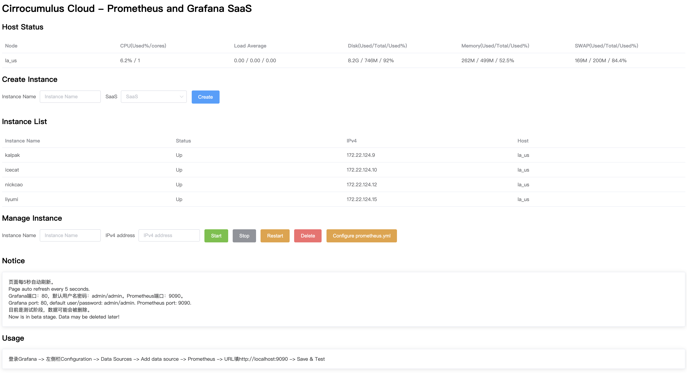

# prometheus_and_grafana_saas

A SAAS platform for Prometheus and Grafana.

# 原理

制作一个docker镜像，里面整合了Prometheus和Grafana。

前端每次新建一个实例，就从这个docker镜像创建，并分配一个ip地址，直接绑定到docker0网桥，同时设置这个容器的端口映射到这个ip地址。（这就是`pro_gra_saas.sh`做的事情）

# 部署

以debian10为例，首先安装docker。默认网桥为`docker0`。

制作prometheus_and_grafana的docker镜像：下载合适的prometheus版本（如 https://github.com/prometheus/prometheus/releases/download/v2.19.2/prometheus-2.19.2.linux-amd64.tar.gz ），解压到本仓库的docker目录下。然后修改Dockerfile，将里面的`prometheus-2.19.2.linux-amd64`这个路径改为实际的prometheus文件夹路径（如果是前面给的版本，则不用改）。

执行`docker build .`构建镜像，然后用`docker tag ...`命令将镜像命名为`pro_gra_saas`。

回到本仓库的根目录，修改`main.py`的监听ip和端口，以及`avail_ip_set`。

`avail_ip_set`为分配给`docker0`网桥的ip，默认加上的是/32掩码。如果你的网络环境不支持使用/32，还需要手动修改`pro_gra_saas.sh`，加上合适的掩码。

# 运行

测试环境直接运行`main.py`即可。生产环境建议根据Flask框架官方文档来设置。

# 说明

目前只支持单机部署。由于时间较少，代码是在 [chn-lee-yumi/lxd_cluster_panel](https://github.com/chn-lee-yumi/lxd_cluster_panel) 的基础上改的，有部分代码冗余没有删除。

# Screenshot

